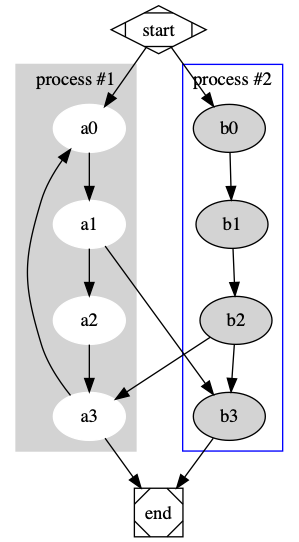

# Obsidian Graphviz


[](https://liberamanifesto.com)

Render [Graphviz](https://graphviz.org/) Diagrams in [Obsidian](https://obsidian.md)

---


This plugin uses local graphviz dot executable for rendering. 


## Usage
1. Install graphviz if you haven't yet.
   To download and install graphviz, follow [official instructions](https://graphviz.org/download/).
1. Inside Obsidian options dialog, `PLUGIN OPTIONS > Obsidian Graphviz > Dot Path`, set path to your dot file.
1. Create a fenced codeblock using `dot` as the language.
   Specify your graphviz code inside. Then preview it.
   Documentation on Graphviz can be found on [graphviz.org](https://graphviz.org/documentation/)

## Examples

```yaml
    ``` dot
    digraph G {

      subgraph cluster_0 {
        style=filled;
        color=lightgrey;
        node [style=filled,color=white];
        a0 -> a1 -> a2 -> a3;
        label = "process #1";
      }

      subgraph cluster_1 {
        node [style=filled];
        b0 -> b1 -> b2 -> b3;
        label = "process #2";
        color=blue
      }
      start -> a0;
      start -> b0;
      a1 -> b3;
      b2 -> a3;
      a3 -> a0;
      a3 -> end;
      b3 -> end;

      start [shape=Mdiamond];
      end [shape=Msquare];
    }
    ```
```
results in:




## Installation

### Inside Obsidian

`Settings > Third-party plugins > Community Plugins > Browse` and search for `Graphviz`.

### Manually installing the plugin
``` bash
git clone https://github.com/QAMichaelPeng/obsidian-graphviz.git
cd obsidian-graphviz
npm i
VAULT_FOLDER=<Your vault folder>
PLUGIN_FOLDER=$VAULT_FOLDER/.obsidian/plugins/obisidan-graph-viz
[ -d "$PLUGIN_FOLDER" ] || mkdir -p $PLUGIN_FOLDER
npm run build && cp  ./{main.js,style.css,manifest.json}/* $PLUGIN_FOLDER
```


## Credits
- Inspired by Johannes Theiner's **[obsidian-plantuml](https://github.com/joethei/obsidian-plantuml)**.
